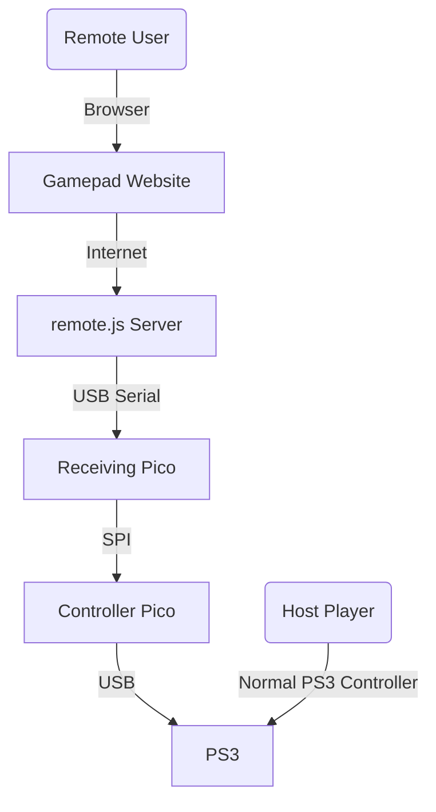

# Remote PS3 Controller

## What is Remote PS3 Controller
Remote PS3 Controller is a project that allows you to play PS3 with your friends over the internet. It uses two RPI Picos for simulating the PS3 controller and a Web Socket to send to the player with the PS3 the data from the remote player. The receiving player needs to portfoward or somehow configure a network tunnel for the receiving server to work. 

Also although I have only tested with a PS3 it should work with any platform with minimum modification of the USB Descriptors and the report struct sent to the device. Also if anyone knows how to properly configure USB descriptors especially the PS3 descripters and a proper report to allow all the PS3 controller features let me know.

The Project as the following diagram:


The program is quite convoluted, there are alot of improvements possible, among them is the the use of only one RPI Pico, or implementing all the functionality of a PS3 controller has currently it doesn't support presure buttons or the PS button. Also the video and audio transmission is not implemented but could be easily fixed by streaming over discord or a platform with less delay, you can find a cheap HDMI to USB receiver on amazon that is more than capable.

## Requirements
  2 Raspberry PI Picos
  
  a PS3
  
  a PC (CMAKE, RPI-PICO SDK configured)
## Circuit Diagram


## Build

1. Create a new folder ```./build```
2. Run ```cmake ..``` inside the build folder
3. Run ```make``` to build uf2 files
4. The files will be compiled inside ```./build/picoCode/``` there will be two folders device and host in each one there will be the uf2 files

## Run

1. Connect the Host Pico to the PC and the Device Pico to the PS3
2. Run ```node serialCommunication/remote.js``` to host the websocket Server
3. Provide the remote player with the website folder or host it in a http server
4. Remote user connects to websocket replacing ```ws://localhost:8080``` with ```ws://<hostIp>:<Port>```

## Credits

Thanks for the previous research in the following posts:


